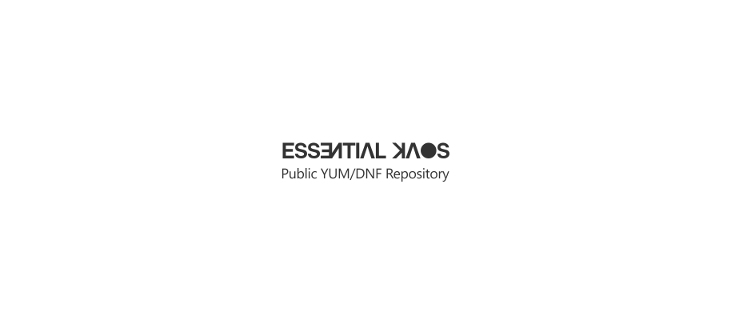

<p align="center"><a href="#readme"></a></p>

<p align="center"><a href="#installation">Installation</a> • <a href="#contributing-guidelines">Contributing Guidelines</a> • <a href="#deletion-policy">Deletion Policy</a> • <a href="#end-of-support-schedule">EoS Schedule</a> • <a href="#perfecto-and-bibop-check-status">CI status</a> • <a href="#license">License</a></p>

<br/>

This repository contains spec files and patches used for building RPM packages for [EK Public Repository](https://pkgs.kaos.st).

### Installation

```bash
sudo yum install -y https://pkgs.kaos.st/kaos-repo-latest.el$(grep 'CPE_NAME' /etc/os-release | tr -d '"' | cut -d':' -f5).noarch.rpm
```

Some packages have dependencies from [EPEL](https://fedoraproject.org/wiki/EPEL) repository. You could add this repository by following commands:

```bash
# CentOS 7 / Alma / Rocky
sudo yum install -y epel-release
# Oracle Linux 7
sudo yum install -y oracle-epel-release-el7
# Oracle Linux 8
sudo dnf install -y oracle-epel-release-el8
# Oracle Linux 9
sudo dnf install -y oracle-epel-release-el9
```

Some packages for EL 8/9 have dependencies from [CodeReady Builder](https://developers.redhat.com/blog/2018/11/15/introducing-codeready-linux-builder) repository. You can enable this repository by following commands:

```bash
# Alma / Rocky
sudo dnf config-manager --set-enabled crb
# Oracle Linux 8
sudo dnf config-manager --set-enabled ol8_codeready_builder
# Oracle Linux 9
sudo dnf config-manager --set-enabled ol9_codeready_builder
```

Building some packages for EL 7 requires [Software Collection](https://wiki.centos.org/SpecialInterestGroup/SCLo) repository. You could add this repository by following command:

```bash
sudo yum install -y centos-release-scl
```

### Contributing Guidelines

If you want to add a new package to the repository, be ready to look after it. It's physically impossible to maintain and keep fresh a large number of packages, especially if you don't use them somewhere.

Also, [bibop](https://kaos.sh/bibop) tests are mandatory for all new packages. It's the only way to test if the package is okay and does not affect other packages in the repository. `bibop` recipe syntax is [easy to learn](https://github.com/essentialkaos/bibop/blob/master/COOKBOOK.md), so don't be afraid of it.

Please find a minute to check out our main [Contributing Guidelines](https://kaos.sh/contributing-guidelines#contributing-guidelines).

### Deletion Policy

Security is our first priority. We can't keep an outdated package in our repository for a long time. If a package spec were not updated for the several latest releases (_especially with known vulnerabilities_) of software, it would be deleted from the repository.

### End-of-Support Schedule

| EL version | Updates     | Repository removal |
|------------|-------------|--------------------|
| `7.x`      | 1 Jun 2024  | 31 Dec 2024        |
| `8.x`      | 1 Jun 2025  | 31 Dec 2025        |
| `9.x`      | 1 Sep 2026  | 31 Dec 2026        |

### [_perfecto_](https://kaos.sh/perfecto) and [bibop](https://kaos.sh/bibop) check status

| Branch | Status |
|--------|--------|
| `master` | [](https://kaos.sh/w/kaos-repo/ci?query=branch:master) |
| `develop` | [](https://kaos.sh/w/kaos-repo/ci?query=branch:develop) |

### License

[Apache License, Version 2.0](https://www.apache.org/licenses/LICENSE-2.0)

<p align="center"><a href="https://essentialkaos.com"></a></p>
